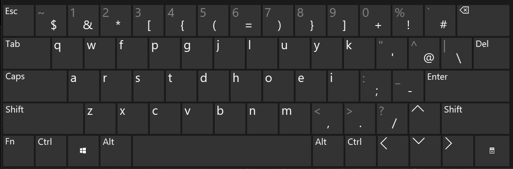

Developer Colemak layout
-------------------------

This is my modified Colemak layout, intended to be better for programming. The main changes compared to the excellent original Colemak layout are:

- All bottom row keys match QWERTY layouts (rather than all but one)
- Numbers in the numbers row are reached with Shift; commonly-used symbols are immediately accessible instead
- Parentheses are on the index fingers, curly braces on the middle fingers, and square brackets on the ring fingers. This makes it very easy and quick to open and close the right kind of bracket.
- A few accents, French and Scandinavian letters are thrown in for good measure

A source file is included for [Microsoft Keyboard Layout Creator](https://www.microsoft.com/en-us/download/details.aspx?id=102134)
